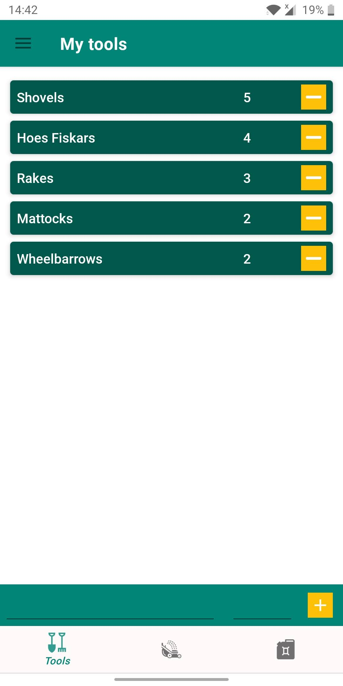
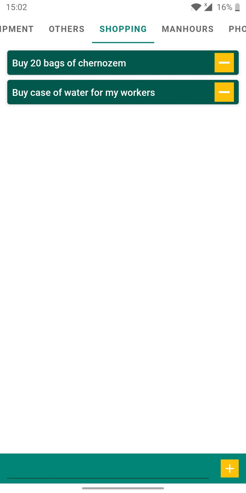

# Gardener
> A useful project of the mobile application for gardeners.  
> It lets authenticate users via Google's account and store data about planned gardens to make.  

## Table of contents
* [General info](#general-info)
* [Screenshots](#screenshots)
* [Technologies](#technologies)
* [Libraries Used](#libraries-used)
* [Setup](#setup)
* [Features](#features)
* [Status](#status)
* [Contact](#contact)
* [License](#license)

## General info
The Gardener is my answer to my brother's needs.  
Besides,  During this development journey, I've learned a lot of knowledge about Android components, tools and best practices.

## Screenshots

  
  
  
  
  
  
  
  
  
  
  
  
  
  
  
  
  
    

## Technologies
The application use several Android Jetpack components and tools such as :
* Data Binding   
* Lifecycles
* LiveData
* Navigation
* ViewModel
* Coroutines
* Dependency Injection
* Android KTX
* Animation & Transitions
* Fragments
* Layouts
* Material Design  

For storing data purposes app use respectively in the latest default firebase branch: Firestore and in older main branch: Realm database. 

## Libraries Used
Third party and miscellaneous libraries
* [Firebase](https://firebase.google.com/) authentication, database and storage
* [FirebaseUI](https://github.com/firebase/FirebaseUI-Android) quickly connect common UI elements to Firebase APIs
* [Glide](https://bumptech.github.io/glide/) for image loading
* [Dagger-Hilt](https://dagger.dev/hilt/) for dependency injection
* [Kotlin Coroutines](https://kotlinlang.org/docs/reference/coroutines-overview.html) for managing background threads with simplified code and reducing needs for callbacks
* [Material Calendar View](https://github.com/prolificinteractive/material-calendarview)
* [Timber](https://github.com/JakeWharton/timber) more powerful logs
* [Number Picker](https://github.com/ShawnLin013/NumberPicker)
* [Android Image Slider](https://github.com/smarteist/Android-Image-Slider)

## Setup
For launch purposes, a developer must get his own Maps API Key for debugging.  
Moreover, it is necessary to get properly configured a google-services.json file from a clean Firebase project.

## Features
List of features ready and TODOs for future development
* Store planned garden in Firestore database.
* Store tools, machines and other things in Firestore database.
* Show periods of work in Calendar

To-do list:
* Completed Gardens Implementation

## Status
The app is currently under development.

## Contact
Created by [@PodwikaGrzegorz](mailto:podwikagrzegorz@gmail.com?subject=[GitHub]%20Gardener%20App) - feel free to contact me!

## License
The MIT License (MIT)

Copyright (c) [2020] [Grzegorz Podwika]

Permission is hereby granted, free of charge, to any person obtaining a copy of this software and associated documentation files (the "Software"), to deal in the Software without restriction, including without limitation the rights to use, copy, modify, merge, publish, distribute, sublicense, and/or sell copies of the Software, and to permit persons to whom the Software is furnished to do so, subject to the following conditions:

The above copyright notice and this permission notice shall be included in all copies or substantial portions of the Software.

THE SOFTWARE IS PROVIDED "AS IS", WITHOUT WARRANTY OF ANY KIND, EXPRESS OR IMPLIED, INCLUDING BUT NOT LIMITED TO THE WARRANTIES OF MERCHANTABILITY, FITNESS FOR A PARTICULAR PURPOSE AND NONINFRINGEMENT. IN NO EVENT SHALL THE AUTHORS OR COPYRIGHT HOLDERS BE LIABLE FOR ANY CLAIM, DAMAGES OR OTHER LIABILITY, WHETHER IN AN ACTION OF CONTRACT, TORT OR OTHERWISE, ARISING FROM, OUT OF OR IN CONNECTION WITH THE SOFTWARE OR THE USE OR OTHER DEALINGS IN THE SOFTWARE.
